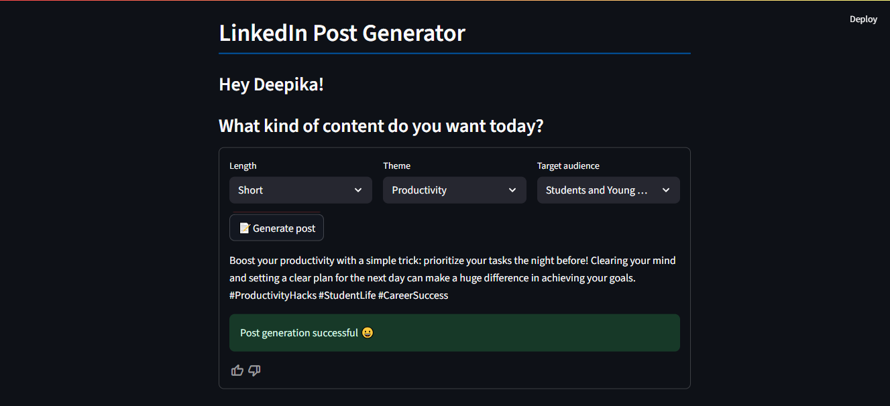

# LinkedIn Post Generator

This project is a LinkedIn Post Generator built with Python and Streamlit. It uses language models to generate posts based on selected themes, target audiences, and post lengths.

Check it out: https://project--linkedin-post-generator-r8unlpjnkywwdxtwpfrpbu.streamlit.app/

## Features

- Generate LinkedIn posts with customizable length, theme, and target audience
- Uses [LangChain](https://github.com/langchain-ai/langchain) and [Groq](https://groq.com/) LLMs
- Streamlit web interface for easy use
- Few-shot learning from example posts

## Output screenshot



## Setup Instructions

### 1. Clone the Repository

```sh
git clone https://github.com/Deepika-20022004/Project--LinkedIn-Post-Generator.git
cd Project-LinkedIn-Post-Generator
```

### 2. Create and Activate a Virtual Environment

**Windows:**
```sh
python -m venv venv
venv\Scripts\activate
```

**macOS/Linux:**
```sh
python3 -m venv venv
source venv/bin/activate
```

### 3. Install Dependencies

```sh
pip install --upgrade pip
pip install -r requirements.txt
```

### 4. Set Up Environment Variables

Create a `.env` file in the project root and add your Groq API key:

```
GROQ_API_KEY=your_groq_api_key_here
```

### 5. Run the App

```sh
streamlit run main.py
```

The app will open in your browser. Select your options and generate LinkedIn posts!

## Notes

- Make sure you are using **Python 3.10, 3.11, or 3.12** (not 3.13).
- For best results, activate your virtual environment before running any commands.

## Project Structure

```
.
├── data/
│   └── processed_posts.json
├── main.py
├── few_shot.py
├── llm_helper.py
├── post_generator.py
├── preprocess.py
├── requirements.txt
└── .env
```
